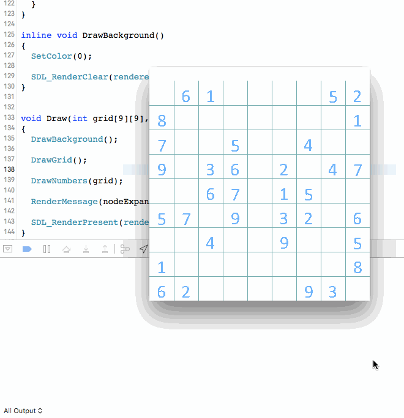
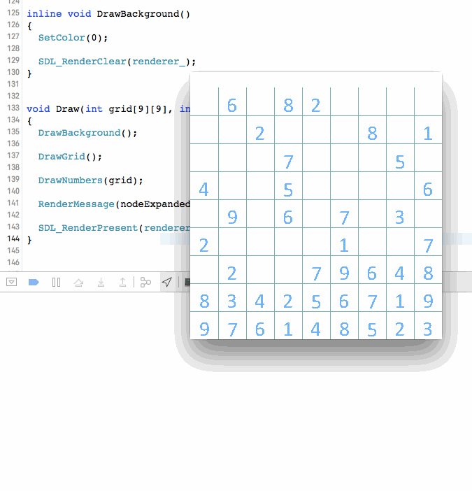

What is shown above is a Sudoku AI implemented with the most naïve backtracking algorithm.

For solving an esay sudoku puzzle, it takes around 3 milliseconds on average.

For solving an "evil" one, it takes about 13 milliseconds.

Graphics demo are presented to show "How AI thinks and tries along the way" XD

Since the sudoku solver is a university assignment, source code will not be published for now.

